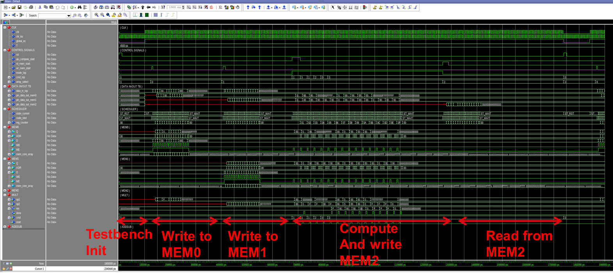

---

# 32-bit Scalable ALU Top Level (`top_32b`)

A 32-bit Arithmetic Logic Unit (ALU) microarchitecture integrated with high-density SRAM macros (`sramHD_64x64`) and state-machine instruction scheduling. Designed and synthesized for the **SkyWater 130nm PDK (`sky130A`)** standard cell flow.

---

## 📊 Design Hierarchy & Netlist Graph

An interactive structural netlist graph generated via AST analysis and logic elaboration is available to inspect module connectivity, data buses, and memory macro interfaces:

* **Interactive Netlist Graph:** [View Verilog Structure Graph](https://github.com/SuzaneANO/RTL_ALU_32b/blob/1st-rollback/graph_generator/verilog_graph.html)

### RTL Architecture Diagram


*(Replace the image path above with your actual screenshot or visual diagram path)*


## 🏛️ System Architecture

The `top_32b` design incorporates functional arithmetic modules, instruction scheduling, and dedicated memory blocks:

```
                                  +---------------------------------------+
                                  |                top_32b                |
                                  |                                       |
    clk, rst, global_en --------->| +-----------------------------------+ |
    alu_compute_start ----------->| |           top_scheduler           | |
    rd_mem_start, wr_mem_start -->| +-----------------------------------+ |
    array_select ---------------->|                   |                   |
    data_in_top [31:0] ---------->|         +---------+---------+         |
                                  |         |                   |         |
                                  |  +--------------+   +--------------+  |
                                  |  |  addsub_32b  |   |   mult_32b   |  |
                                  |  +--------------+   +--------------+  |
                                  |         |                   |         |
                                  |         +---------+---------+         |
                                  |                   |                   |
                                  |  +---------------------------------+  |
                                  |  |  SRAM Memory Blocks (OpenRAM)   |  |
                                  |  |  [MEM0]   [MEM1]   [MEM2]       |  |
                                  |  | (sramHD_64x64 Macro Blackboxes) |  |
                                  |  +---------------------------------+  |
                                  +---------------------------------------+

```

### Module Breakdown

1. **`top_32b` (Top-Level Wrapper):** Interconnects control signals, routes data buses, manages memory array selection, and instantiates memory macros.


2. **`top_scheduler` (Control FSM):** Finite State Machine managing compute sequencing, memory read/write cycles, and counter-driven address translation.


3. **`addsub_32b` (32-bit Adder/Subtractor):** 32-bit arithmetic module performing addition and subtraction operations.


4. **`mult_32b` (32-bit Multiplier):** 32-bit multiplication unit generating 64-bit full-precision results.


5. **`sramHD_64x64` (Memory Macro):** 64-word $\times$ 64-bit high-density SRAM memory block treated as an ASIC blackbox during synthesis.


---

## 📊 Design Hierarchy & Netlist Graph

An interactive structural netlist graph generated via AST analysis and logic elaboration is available for visual inspection:

* **Interactive Web View:** `verilog_graph.html`

### Gate & Cell Count Summary

According to Yosys elaboration and logic mapping outputs:

| Module Name | Primitive / Logic Cells | Wires | Bits | Memory Blackboxes |
| :--- | :--- | :--- | :--- | :--- |
| **`top_scheduler`** | 48 cells | 43 | 70 | — |
| **`addsub_32b`** | 935 cells | 878 | 1,068 | — |
| **`mult_32b`** | 12,594 cells | 12,477 | 12,919 | — |
| **`top_32b` (Local)** | 312 cells | 132 | 912 | 3x `sramHD_64x64` |
| **Total Top Hierarchy** | **13,889 cells** | **13,530** | **14,969** | **3 Instances** |
---

## 🛠️ Build & Verification Pipeline

The repository provides automated Makefile targets for linting, elaboration, synthesis, and physical design configuration generation.

### 1. Static Verification & Linting

Run Verilator lint checks across all RTL sources:

```bash
make lint

```

### 2. Logic Synthesis (Yosys)

Synthesize the design targeting SkyWater 130nm library components while keeping `sramHD_64x64` as a blackbox:

```bash
make synth

```

Generates gate-level netlist `build/top_32b.gate.v` and log `reports/synthesis.log`.

### 3. OpenLane Physical Design Setup

Generate the complete `config.json` file for LibreLane / OpenLane 2 floorplanning and macro placement:

```bash
make openlane_config

```

#### OpenLane Macro Placement Config (`config.json`)

The generated configuration handles macro positioning for the three SRAM blocks:

```json
{
  "DESIGN_NAME": "top_32b",
  "CLOCK_PORT": "clk",
  "CLOCK_PERIOD": 10.0,
  "MACROS": {
    "sramHD_64x64": {
      "gds": ["macros/sramHD_64x64.gds"],
      "lef": ["macros/sramHD_64x64.lef"],
      "instances": {
        "MEM0": {"location": [50, 50], "orientation": "N"},
        "MEM1": {"location": [50, 450], "orientation": "N"},
        "MEM2": {"location": [600, 250], "orientation": "FN"}
      }
    }
  },
  "FP_SIZING": "absolute",
  "DIE_AREA": [0, 0, 1200, 1000],
  "PL_TARGET_DENSITY": 0.45
}

```

---

## 📂 File Structure

```text
.
├── addsub_32b.v        # 32-bit Adder/Subtractor RTL
├── mult_32b.v          # 32-bit Multiplier RTL
├── top_scheduler.v     # State Machine Controller RTL
├── top_32b.v           # Top-Level Structural RTL
├── alu32_pkg.vh        # ALU Package & Header Definitions
├── sramHD_64x64.v      # SRAM Memory Stub / Blackbox Definition
├── Makefile            # Build pipeline script
├── macros/             # Macro LEF, LIB, and GDS files
│   ├── sramHD_64x64.lef
│   ├── sramHD_64x64.lib
│   └── sramHD_64x64.gds
└── reports/            # Output logs (linting & synthesis)

```
